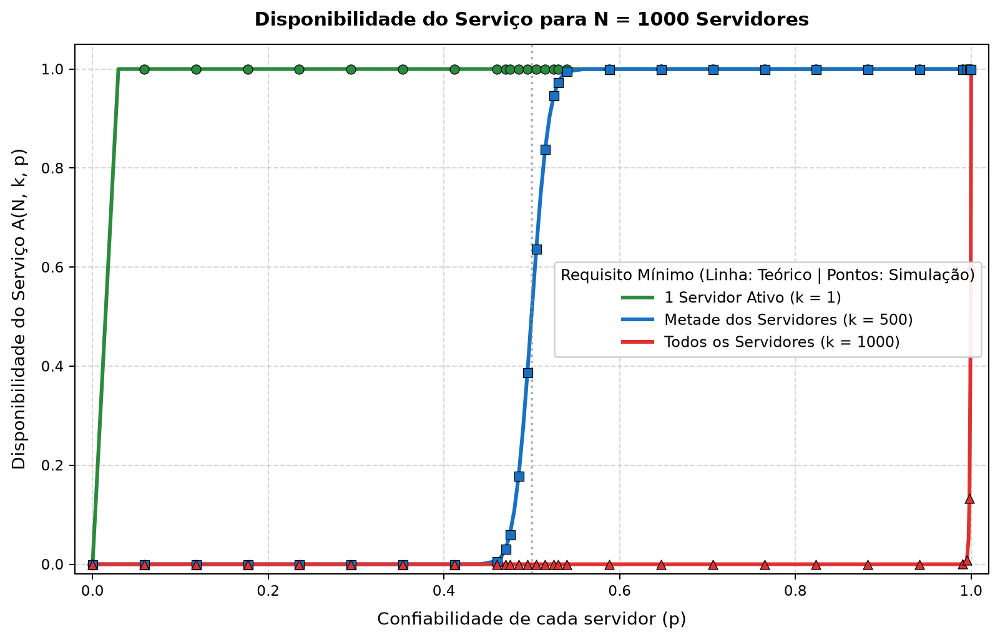
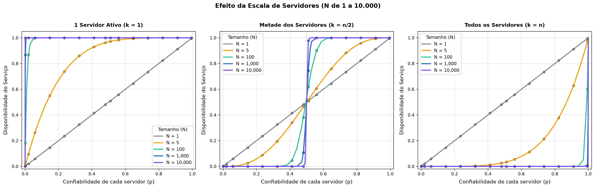
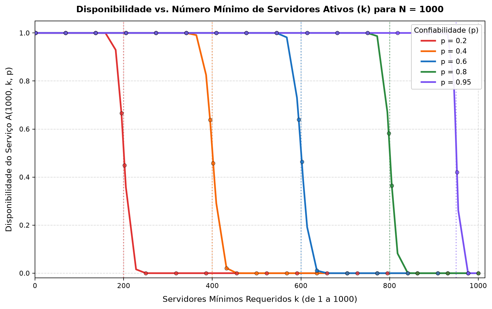

# Disponibilidade em Sistemas Distribuídos

> Disciplina: Computação Distribuída  
> Professor: Prof. Nabor C. Mendonça - UNIFOR

Este repositório contém a dedução matemática e a implementação computacional (modelo teórico e simulação estocástica de Monte Carlo) para avaliar a disponibilidade de um serviço replicado em múltiplos servidores sob diferentes requisitos de disponibilidade, escala e consistência.

---

## 1. Definição do Problema

Em sistemas distribuídos, a replicação de serviços introduz um compromisso fundamental entre tolerância a falhas para leitura e coordenação para escrita. O modelo avalia a disponibilidade $A(n, k, p)$ de um serviço composto por $n$ servidores independentes sujeito a um número mínimo de servidores operacionais $k$.

### Parâmetros:
* $n$: Número total de servidores no cluster ($n > 0$).
* $k$: Número mínimo de servidores ativos necessários para a operação ter sucesso ($0 < k \le n$).
* $p$: Confiabilidade individual de cada servidor (probabilidade de estar disponível, $0 \le p \le 1$).

---

## 2. Dedução Matemática

Para compreender como a disponibilidade do serviço é calculada, podemos construir o modelo partindo do caso mais elementar de uma única máquina e evoluir gradualmente até o cluster completo.

### O Caso de um Único Servidor ($n = 1$)

Considere inicialmente um único servidor $j$. Em um dado instante, ele só pode estar em um de dois estados possíveis: operacional (ativo) ou inoperante (inativo). Podemos modelar esse comportamento como um ensaio de Bernoulli por meio de uma variável aleatória binária $X_j \in \{0, 1\}$:

$$P(X_j = 1) = p \quad (\text{servidor ativo})$$
$$P(X_j = 0) = 1 - p \quad (\text{servidor inativo})$$

Se o sistema depender exclusivamente dessa única máquina ($n = 1$ e $k = 1$), a disponibilidade do serviço $A$ coincide diretamente com a confiabilidade do nó individual:

$$A(1, 1, p) = P(X_1 = 1) = p$$

### Generalizando para $n$ Servidores Independentes

Quando expandimos o sistema para um cluster com $n$ servidores ($X_1, X_2, \dots, X_n$), consideramos que as falhas entre as máquinas são **estatisticamente independentes**, ou seja, a queda de um servidor não afeta a probabilidade de falha dos demais.

A quantidade total de servidores disponíveis no sistema em um determinado momento é dada pela soma dessas variáveis individuais:

$$X = \sum_{j=1}^{n} X_j$$

Como cada $X_j$ assume valor $0$ ou $1$, o valor de $X$ é uma variável aleatória discreta que representa o número total de máquinas ativas, podendo assumir qualquer valor inteiro no intervalo de $0$ a $n$ ($X \in \{0, 1, 2, \dots, n\}$).

### Probabilidade de uma Configuração Específica

Se quisermos determinar a probabilidade de uma combinação fixa específica onde exatamente $i$ servidores estejam ativos e os outros $(n - i)$ estejam inativos (por exemplo, os primeiros $i$ servidores ativos e o restante inativo), utilizamos a regra da probabilidade conjunta para eventos independentes:

$$P(\text{configuração específica}) = \underbrace{p \times p \times \dots \times p}_{i \text{ servidores ativos}} \times \underbrace{(1 - p) \times (1 - p) \times \dots \times (1 - p)}_{(n - i) \text{ servidores inativos}} = p^i (1 - p)^{n - i}$$

### Contando as Combinações e a Distribuição Binomial

Em um sistema prático, não importa *quais* máquinas específicas estão operacionais, mas apenas a *quantidade total* de máquinas ativas. Como existem diversas formas de escolher quais $i$ máquinas estão ativas dentro de um grupo de $n$ máquinas, precisamos contar todas as permutações possíveis. 

Essa contagem é dada pelo coeficiente binomial (combinação simples de $n$ elementos tomados $i$ a $i$):

$$\binom{n}{i} = \frac{n!}{i!(n - i)!}$$

Multiplicando o número total de combinações possíveis pela probabilidade de ocorrência de cada uma, obtemos a probabilidade exata de haver **exatamente $i$ servidores ativos**:

$$P(X = i) = \binom{n}{i} p^i (1 - p)^{n - i}$$

Essa equação define a função de probabilidade da **Distribuição Binomial**, representada por $X \sim \text{Binomial}(n, p)$.

### Requisito Mínimo de Servidores Ativos ($X \ge k$)

Em sistemas distribuídos, uma operação raramente exige que haja *exatamente* uma quantidade fixa de nós. O requisito de disponibilidade estabelece que deve haver **pelo menos $k$ servidores ativos** para que a operação seja executada com sucesso ($k, k + 1, k + 2, \dots, n$).

Como os eventos de ter exatamente $k$ servidores, exatamente $k + 1$ servidores, e assim sucessivamente, são mutuamente exclusivos (não podem ocorrer simultaneamente na mesma rodada), a probabilidade da união desses eventos é a soma de suas probabilidades individuais:

$$P(X \ge k) = P(X = k) + P(X = k + 1) + \dots + P(X = n)$$

Substituindo a expressão da distribuição binomial em cada termo, chegamos à **Fórmula Geral da Disponibilidade**:

$$A(n, k, p) = \sum_{i=k}^{n} \binom{n}{i} p^i (1 - p)^{n - i}$$

### Comportamento nos Casos Particulares

A partir dessa formulação geral, podemos derivar diretamente as expressões simplificadas para as três configurações avaliadas neste trabalho:

* **1 Servidor Ativo ($k = 1$):** O serviço só fica indisponível se todos os $n$ servidores falharem simultaneamente, evento cuja probabilidade é $(1 - p)^n$. Pelo evento complementar, a disponibilidade se reduz a:
  $$A(n, 1, p) = 1 - P(X = 0) = 1 - (1 - p)^n$$

* **Todos os Servidores ($k = n$):** Existe apenas uma única combinação em que todos os $n$ nós estão operacionais ao mesmo tempo, reduzindo o cálculo ao produto direto:
  $$A(n, n, p) = P(X = n) = p^n$$

* **Metade dos Servidores ($k = \lceil n/2 \rceil$):** Exige o somatório sobre toda a metade superior de servidores ativos:
  $$A\left(n, \left\lceil \frac{n}{2} \right\rceil, p\right) = \sum_{i=\lceil n/2 \rceil}^{n} \binom{n}{i} p^i (1 - p)^{n - i}$$

---

## 3. Implementação e Simulação em Larga Escala

O simulador em Python ([`simulador.py`](simulador.py)) foi otimizado para lidar tanto com clusters pequenos quanto com milhares de máquinas ($N$ de 1 a 10.000):

1. **Modelo Teórico:**
   - Em sistemas de grande porte ($n \ge 1000$), os coeficientes binomiais $\binom{n}{i}$ excedem os limites numéricos padrão de ponto flutuante ($> 10^{308}$).
   - Para garantir exatidão sem estouro de memória ou *overflow*, o cálculo teórico é computado via função de sobrevivência binomial (`scipy.stats.binom.sf(k - 1, n, p)`), mantendo estabilidade numérica em qualquer escala.

2. **Simulador de Monte Carlo:**
   - Para cada cenário, executam-se $30.000$ rodadas independentes.
   - A contagem de nós ativos em cada rodada é gerada diretamente por amostragem binomial vetorizada (`rng.binomial(n, p, size=rodadas)`), permitindo simular clusters de até $10.000$ servidores em milissegundos com exatidão estatística.

---

## 4. Análise dos Resultados e Gráficos

A simulação de Monte Carlo confirmou a precisão da dedução teórica: o **Erro Absoluto Médio geral foi de apenas $0.00034$ ($< 0.04\%$)**, demonstrando que os resultados simulados reproduzem com alta fidelidade a probabilidade teórica esperada.

---

### 4.1 Disponibilidade para $N = 1000$ Servidores: 1 Servidor Ativo ($k = 1$), Metade dos Servidores ($k = n/2$) e Todos os Servidores ($k = n$)

Este gráfico analisa o comportamento de um cluster de grande porte ($N = 1000$ servidores) sob os três requisitos operacionais de servidores mínimos:



#### Funcionamento e Análise:
* **1 Servidor Ativo ($k = 1$):**
  - Basta um único servidor estar de pé para a operação ser atendida.
  - Com $1000$ máquinas, a chance de todos falharem ao mesmo tempo é $(1-p)^{1000}$, que se torna quase nula assim que $p > 0.01$. Portanto, mesmo com máquinas muito instáveis, o serviço permanece praticamente $100\%$ disponível.
* **Metade dos Servidores ($k = 500$):**
  - Exige que pelo menos metade dos servidores estejam disponíveis.
  - Em grande escala, a curva adquire a forma de um **degrau acentuado centrado em $p = 0.5$**:
    - Se a confiabilidade individual for inferior a $50\%$ ($p < 0.48$), o sistema quase nunca consegue reunir metade das máquinas, e a disponibilidade despenca para $0\%$.
    - Se a confiabilidade individual superar $50\%$ ($p > 0.52$), a probabilidade de obter metade das máquinas ativas salta para praticamente $100\%$.
* **Todos os Servidores ($k = 1000$):**
  - Exige que absolutamente todos os servidores estejam simultaneamente ativos.
  - A disponibilidade é $p^{1000}$. A probabilidade de todas as 1000 máquinas estarem operacionais ao mesmo tempo é praticamente zero em quase todo o intervalo, só se tornando viável quando a confiabilidade de cada máquina é quase perfeita ($p \ge 0.998$).

---

### 4.2 Efeito da Escala de Servidores ($N$ de 1 a 10.000): 1 Servidor Ativo ($k = 1$), Metade dos Servidores ($k = n/2$) e Todos os Servidores ($k = n$)

Este painel compara como o aumento do tamanho do cluster ($N \in \{1, 5, 100, 1000, 10000\}$) afeta individualmente cada uma das três configurações:



#### Funcionamento e Análise:
* **Painel 1: 1 Servidor Ativo ($k = 1$):**
  - Para $N = 1$, a disponibilidade é uma reta idêntica à do próprio servidor ($A = p$).
  - Conforme adicionamos mais servidores ($N = 5, 100, 1000, 10000$), a curva é empurrada cada vez mais para o canto superior esquerdo. Com $10.000$ servidores, a probabilidade de falha coletiva simultânea é desprezível, garantindo disponibilidade máxima quase contínua mesmo com máquinas de baixa confiabilidade.
* **Painel 2: Metade dos Servidores ($k = \lceil N/2 \rceil$):**
  - Todas as curvas cruzam exatamente o ponto $p = 0.5$, onde a disponibilidade é de $50\%$.
  - **Semelhança com a função degrau quando $N$ cresce:** Em sistemas pequenos ($N = 1$ ou $N = 5$), a curva é suave e inclinada. No entanto, conforme $N$ cresce para $100$, $1000$ e $10000$, a transição em torno de $p = 0.5$ se torna cada vez mais abrupta, aproximando-se visualmente e matematicamente de uma função degrau:
    - Para qualquer valor de $p < 0.5$, a disponibilidade cai assintoticamente para $0$.
    - Para qualquer valor de $p > 0.5$, a disponibilidade sobe assintoticamente para $1$.
    - Isso mostra que, em sistemas massivos, o comportamento deixa de ser probabilístico e passa a ser quase determinístico: ter mais de $50\%$ de nós confiáveis garante praticamente $100\%$ de chance de ter metade das máquinas ativas.
* **Painel 3: Todos os Servidores ($k = N$):**
  - Como a operação depende de $100\%$ das máquinas estarem ativas, adicionar servidores aumenta exponencialmente a probabilidade de pelo menos um deles falhar.
  - Para $N = 5$, a curva decai rapidamente ($p^5$). Para $N \ge 100$, a disponibilidade é essencialmente zero em praticamente todo o espectro, a menos que $p$ esteja extremamente próximo de $1.0$. Isso comprova que exigir a presença de todos os nós impede o escalonamento em grande escala.

---

### 4.3 Disponibilidade vs. Número Mínimo de Servidores Ativos ($k$) para $N = 1000$

Neste experimento, fixamos o tamanho do cluster em $N = 1000$ e variamos o requisito $k$ de $1$ até $1000$, sob diferentes confiabilidades individuais ($p \in \{0.2, 0.4, 0.6, 0.8, 0.95\}$):



#### Funcionamento e Análise:
* Em um cluster de $1000$ servidores, o número médio de servidores que esperamos encontrar ativos é dado por $N \cdot p$:
  - Para $p = 0.2$, esperamos cerca de $200$ servidores ativos.
  - Para $p = 0.4$, esperamos cerca de $400$ servidores ativos.
  - Para $p = 0.6$, esperamos cerca de $600$ servidores ativos.
  - Para $p = 0.8$, esperamos cerca de $800$ servidores ativos.
  - Para $p = 0.95$, esperamos cerca de $950$ servidores ativos.
* Na prática, com uma quantidade grande de servidores, o sistema se comporta de forma muito estável e previsível. É extremamente raro encontrar uma quantidade de máquinas ativas distante dessa média esperada. Por isso:
  - **Se a operação exige menos servidores do que essa média ($k < N \cdot p$):** Quase sempre haverá máquinas suficientes ativas para cumprir o requisito, resultando em uma disponibilidade de praticamente $100\%$.
  - **Se a operação exige mais servidores do que essa média ($k > N \cdot p$):** O sistema raramente terá tantas máquinas ligadas ao mesmo tempo, fazendo com que a disponibilidade despenque rapidamente para $0\%$.
* As linhas verticais pontilhadas indicam exatamente esse valor médio $N \cdot p$, onde ocorre a virada brusca entre o sistema funcionar plenamente e parar de responder.

---

### 4.4 Amostra dos Dados Tabulados

Os dados completos de todas as simulações estão disponíveis em arquivos CSV no diretório `resultados/`:
- `tabela_operacoes_n1000.csv`
- `tabela_escala_n.csv`
- `tabela_variando_k_n1000.csv`

#### Amostra: Operações em $N = 1000$

| N | k | Configuração | p | Teórico | Simulado | Erro Absoluto |
| :---: | :---: | :---: | :---: | :---: | :---: | :---: |
| 1000 | 1 | 1 Servidor Ativo (k = 1) | 0.05 | 1.000000 | 1.000000 | 0.000000 |
| 1000 | 1 | 1 Servidor Ativo (k = 1) | 0.50 | 1.000000 | 1.000000 | 0.000000 |
| 1000 | 500 | Metade dos Servidores (k = n/2) | 0.47 | 0.029853 | 0.029700 | 0.000153 |
| 1000 | 500 | Metade dos Servidores (k = n/2) | 0.49 | 0.264259 | 0.266267 | 0.002008 |
| 1000 | 500 | Metade dos Servidores (k = n/2) | 0.50 | 0.512613 | 0.511733 | 0.000880 |
| 1000 | 500 | Metade dos Servidores (k = n/2) | 0.51 | 0.749005 | 0.745467 | 0.003538 |
| 1000 | 500 | Metade dos Servidores (k = n/2) | 0.53 | 0.972986 | 0.973400 | 0.000414 |
| 1000 | 1000 | Todos os Servidores (k = n) | 0.99 | 0.000043 | 0.000000 | 0.000043 |
| 1000 | 1000 | Todos os Servidores (k = n) | 0.999 | 0.367695 | 0.368667 | 0.000972 |
| 1000 | 1000 | Todos os Servidores (k = n) | 1.00 | 1.000000 | 1.000000 | 0.000000 |

---

## 5. Como Executar

### Pré-requisitos
* Python 3.10 ou superior
* Git

### Instruções

```bash
# 1. Clonar o repositório
git clone git@github.com:pleneo/distribute-computing-availability.git
cd distribute-computing-availability

# 2. Configurar o ambiente virtual
python3 -m venv .venv
source .venv/bin/activate

# 3. Instalar dependências
pip install -r requirements.txt

# 4. Executar simulação completa
python simulador.py

# 5. Executar com parâmetros personalizados
python simulador.py --rodadas 50000 --passos 40
```

Os gráficos gerados e os dados em CSV são salvos automaticamente no diretório `resultados/`.

---

## 6. Estrutura do Repositório

```text
├── .gitignore
├── requirements.txt                    # Dependências (numpy, matplotlib, pandas, scipy)
├── simulador.py                        # Script do modelo teórico e simulação estocástica
├── README.md                           # Documentação técnica com gráficos e análises
└── resultados/                         # Gráficos e tabelas gerados
    ├── grafico_operacoes_n1000.png     # N=1000 fixo: 1 Servidor (k=1), Metade (k=n/2) e Todos (k=n)
    ├── grafico_escala_n_tres_operacoes.png # Escala de N (1 a 10.000) para k=1, k=n/2 e k=n
    ├── grafico_n1000_variando_k.png    # N=1000 fixo com k variando de 1 a 1000
    ├── tabela_operacoes_n1000.csv
    ├── tabela_escala_n.csv
    ├── tabela_variando_k_n1000.csv
    └── tabela_comparativa.csv
```
