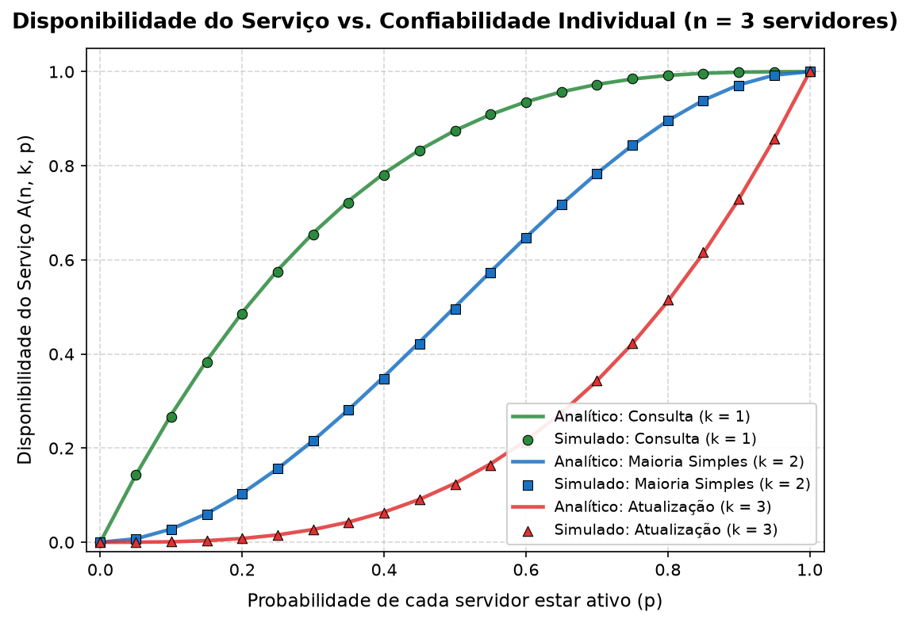
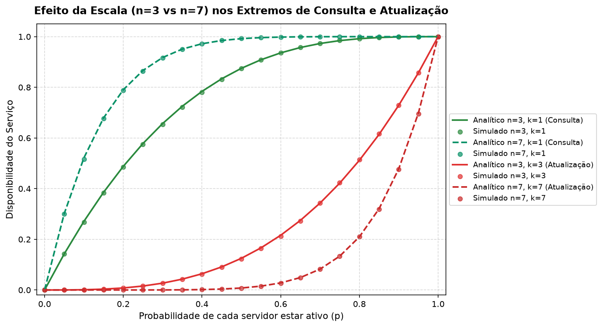

# Disponibilidade em Sistemas Distribuídos

> Disciplina: Computação Distribuída  
> Professor: Prof. Nabor

Este repositório contém a dedução matemática e a implementação computacional (analítica e estocástica) para avaliar a disponibilidade de um serviço replicado em múltiplos servidores sob diferentes requisitos de disponibilidade e consistência.

---

## 1. Definição do Problema

Em sistemas distribuídos, a replicação de serviços introduz um compromisso entre tolerância a falhas para leitura e custo de coordenação para escrita. O modelo avalia a disponibilidade $A(n, k, p)$ de um serviço composto por $n$ servidores independentes sujeito a um número mínimo de servidores operacionais $k$.

### Parâmetros:
* $n$: Número total de servidores réplicas ($n > 0$).
* $k$: Número mínimo de servidores disponíveis necessários para a operação ser realizada com sucesso ($0 < k \le n$).
* $p$: Probabilidade de cada servidor individual estar disponível em um dado instante ($0 \le p \le 1$).

---

## 2. Dedução Analítica

Cada servidor $j$ ($j = 1, \dots, n$) é modelado como uma variável aleatória de Bernoulli independente $X_j \in \{0, 1\}$, onde $P(X_j = 1) = p$ (servidor operacional) e $P(X_j = 0) = 1 - p$ (servidor inoperante).

A quantidade de servidores disponíveis no cluster em um dado instante é representada pela variável aleatória:

$$X = \sum_{j=1}^{n} X_j$$

Como os servidores falham de forma independente, $X$ segue uma Distribuição Binomial: $X \sim \text{Binomial}(n, p)$.

A disponibilidade do serviço $A(n, k, p)$ corresponde à probabilidade de haver pelo menos $k$ servidores ativos:

$$A(n, k, p) = P(X \ge k) = \sum_{i=k}^{n} \binom{n}{i} p^i (1 - p)^{n - i}$$

onde o coeficiente binomial é definido por:

$$\binom{n}{i} = \frac{n!}{i!(n - i)!}$$

---

## 3. Implementação e Simulação Estocástica

O pipeline em Python (`simulador.py`) compara os valores da fórmula analítica com uma simulação estocástica de Monte Carlo:

1. **Cálculo Analítico:** Avaliação direta do somatório binomial acumulado e das formas fechadas para $k=1$ e $k=n$.
2. **Simulador de Monte Carlo:**
   - Para cada tupla $(n, k, p)$, o simulador executa $N$ rodadas (padrão: 30.000 amostras).
   - Em cada rodada, o estado de cada nó é amostrado via $U(0, 1) \le p$.
   - O serviço é computado como disponível se a soma de nós ativos na rodada for $\ge k$.
   - A frequência relativa experimental ($\text{sucessos} / N$) é confrontada com a disponibilidade analítica correspondente.

---

## 4. Resultados e Análise Comparativa

A comparação entre os valores analíticos e experimentais demonstra convergência assintótica em conformidade com a Lei dos Grandes Números. O Erro Absoluto Médio observado foi inferior a $0.0009$ ($< 0.1\%$).

### Disponibilidade vs. Confiabilidade Individual ($n = 3$)

Comparação entre operação de consulta ($k=1$), maioria simples ($k=2$) e atualização ($k=3$):



* **Consulta ($k=1$):** Curva com concavidade voltada para baixo. Atinge alta disponibilidade mesmo com valores moderados de $p$.
* **Maioria Simples ($k=2$):** Curva sigmoide com ponto de inflexão em $p = 0.5$. Para $p > 0.5$, o agrupamento em cluster amplia a disponibilidade em relação ao nó isolado; para $p < 0.5$, a disponibilidade é degradada.
* **Atualização ($k=3$):** Curva convexa. A disponibilidade decai rapidamente e requer valores de $p$ próximos a $1.0$ para viabilidade prática.

### Impacto da Escala nos Cenários de Consulta e Atualização ($n = 3$ vs. $n = 7$)

Efeito do aumento do número de réplicas sobre as operações de consulta e atualização:



* Para operações com $k=1$, o aumento de réplicas expande a disponibilidade de forma exponencial.
* Para operações com $k=n$, o aumento de nós amplifica a probabilidade de falha coletiva, reduzindo drasticamente a disponibilidade do cluster para escrita.

### Amostra dos Dados Tabulados

Os dados consolidados de todos os cenários estão disponíveis em `resultados/tabela_comparativa.csv`.

| n | k | Operação | p | Analítico | Simulado | Erro Absoluto |
| :---: | :---: | :---: | :---: | :---: | :---: | :---: |
| 3 | 1 | Consulta (k = 1) | 0.20 | 0.48800 | 0.48483 | 0.00317 |
| 3 | 1 | Consulta (k = 1) | 0.50 | 0.87500 | 0.87320 | 0.00180 |
| 3 | 1 | Consulta (k = 1) | 0.80 | 0.99200 | 0.99187 | 0.00013 |
| 3 | 2 | Maioria (k = 2) | 0.50 | 0.50000 | 0.49527 | 0.00473 |
| 3 | 2 | Maioria (k = 2) | 0.80 | 0.89600 | 0.89540 | 0.00060 |
| 3 | 3 | Atualização (k = 3) | 0.80 | 0.51200 | 0.51350 | 0.00150 |
| 3 | 3 | Atualização (k = 3) | 0.90 | 0.72900 | 0.72757 | 0.00143 |

---

## 5. Como Executar

### Pré-requisitos
* Python 3.10 ou superior
* Git

### Instruções

```bash
# 1. Clonar o repositório
git clone git@github.com:pleneo/distribute-computing-availability.git
cd distribute-computing-availability

# 2. Configurar o ambiente virtual
python3 -m venv .venv
source .venv/bin/activate

# 3. Instalar dependências
pip install -r requirements.txt

# 4. Executar simulação
python simulador.py

# 5. Executar com parâmetros personalizados
python simulador.py --rodadas 50000 --passos 41
```

Os artefatos gerados são salvos automaticamente no diretório `resultados/`.

---

## 6. Estrutura do Repositório

```text
├── .gitignore
├── requirements.txt            # Dependências do projeto (numpy, matplotlib, pandas)
├── simulador.py                # Script contendo o cálculo analítico e simulação Monte Carlo
├── README.md                   # Documentação técnica do trabalho
└── resultados/                 # Diretório de artefatos de saída
    ├── tabela_comparativa.csv  # Tabela com dados analíticos e experimentais
    ├── grafico_disponibilidade_n3.png
    ├── grafico_disponibilidade_n5.png
    ├── grafico_disponibilidade_n7.png
    └── grafico_comparativo_escala.png
```
